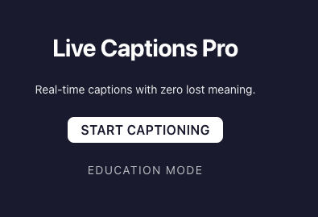
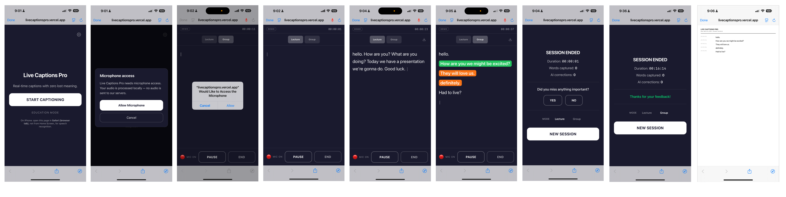

# Live Captions Pro



## Live Captions Pro Screenshots


Real-time live captioning with zero lost meaning — built for Deaf and hard of hearing users in education.

**Live app:** https://livecaptionspro.vercel.app

## What It Does

Live Captions Pro is a Progressive Web App that gives Deaf and hard-of-hearing users real-time captions with visual confidence indicators — so they always know which words to trust and which to question.

**Core Features:**
- **Live Captions** — Word-by-word captions under 1 second latency
- **Confidence Highlighting** — Per-word color coding (white / amber / blue) shows certainty in real time
- **Lecture Mode** — Flowing paragraph captions with confidence colors for single-speaker use
- **Group Mode** — Color-coded speaker blocks for multi-speaker conversations
- **Speaker Diarization** — Deepgram detects who is speaking and colors lines per speaker
- **Pause / Resume** — Pause the mic mid-session without losing your transcript
- **Save as PDF** — Export the full timestamped transcript directly from the session
- **AI Gap Filler** — Gemini corrects misheard words using surrounding context
- **PWA** — Installable on iOS and Android, works without app store

## Confidence Color System

| Color | Meaning | Confidence |
|-------|---------|-----------|
| White | Confirmed — STT is certain | ≥ 90% |
| Amber | Uncertain — may be mishearing | 70–89% |
| Blue highlight | Predicted — low confidence or AI-corrected | < 70% |

## Display Modes

| Mode | Best for | Colors |
|------|---------|--------|
| **Lecture** | Single speaker, classroom | Per-word confidence (white/amber/blue) |
| **Group** | 2–4 speakers, meetings | Per-speaker color blocks |

Switch modes mid-session using the toggle in the header — each mode starts fresh.

## Tech Stack

| Layer | Technology |
|-------|-----------|
| Framework | Next.js 16 (App Router) + TypeScript |
| Styling | Tailwind CSS |
| Speech-to-Text (default) | Web Speech API (browser built-in, free) |
| Speech-to-Text (enhanced) | Deepgram Nova-3 (per-word confidence + diarization) |
| AI Gap Filler | Google Gemini 2.5 Flash API |
| Noise Filtering | RNNoise WASM (AudioWorklet) |
| Hosting | Vercel |
| Testing | Vitest + React Testing Library + Playwright (251 tests) |

## Getting Started

### Prerequisites
- Node.js 20+
- npm
- A Google Gemini API key ([get one free](https://ai.google.dev/))
- Optional: A Deepgram API key for enhanced confidence + speaker detection ([get one free — $200 credit](https://console.deepgram.com))

### Setup

```bash
git clone https://github.com/MichaelFehdrau0205/livecaptionspro.git
cd livecaptionspro
npm install
cp .env.example .env.local   # then fill in your keys
```

Edit `.env.local`:

```
GEMINI_API_KEY=your_gemini_api_key_here

# Optional — enables real-time per-word confidence + speaker colors
NEXT_PUBLIC_DEEPGRAM_API_KEY=your_deepgram_api_key_here
```

> **Tip:** You can also enter your Deepgram key directly in the app — tap ⚙️ on the start screen.

### Run Locally

```bash
npm run dev
```

Open [http://localhost:3000](http://localhost:3000) in Chrome or Safari.

### Run Tests

```bash
npm run test          # Unit tests (Vitest) — 251 tests
npm run test:e2e      # E2E tests (Playwright)
npm run lint          # Linting
```

## How It Works

**With Deepgram (recommended):**
1. Tap **Start Captioning** — mic connects to Deepgram via WebSocket
2. PCM audio streams to Deepgram Nova-3 in real time
3. Words appear colored by confidence immediately as you speak
4. In Group mode, different speakers get different colored blocks
5. Sentences also sent to Gemini for text correction in the background

**Without Deepgram (fallback):**
1. Web Speech API transcribes speech (<1s latency)
2. RNNoise filters background noise
3. Sentences sent to Gemini for confidence scoring + correction
4. **DEMO** badge shown in status bar

## Session Controls

| Button | Action |
|--------|--------|
| **PAUSE** | Stops mic, keeps transcript on screen |
| **RESUME** | Restarts mic, continues session |
| **↓ (download icon)** | Save transcript as PDF (available mid-session) |
| **END** | Ends session, shows stats + save option |

## Browser Compatibility

| Browser | STT | Confidence | PWA |
|---------|-----|-----------|-----|
| Chrome (desktop/Android) | ✅ | ✅ with Deepgram | ✅ |
| Safari (iOS/macOS) | ✅ | ✅ with Deepgram | ✅ |
| Edge | ✅ | ✅ with Deepgram | ✅ |
| Firefox | ❌ No Web Speech API | ✅ with Deepgram | ✅ |

> **iOS:** Open in Safari as a browser tab (not from Home Screen) for speech recognition. Enable Dictation in Settings → General → Keyboard.

## Deployment

Deployed automatically to Vercel on push to `main`. Pull requests get preview deployments.

Set in Vercel dashboard → Environment Variables:
- `GEMINI_API_KEY` — required
- `NEXT_PUBLIC_DEEPGRAM_API_KEY` — optional, enables enhanced confidence + speaker colors

## Authors

- Luba Kaper
- Michael Fehdrau
